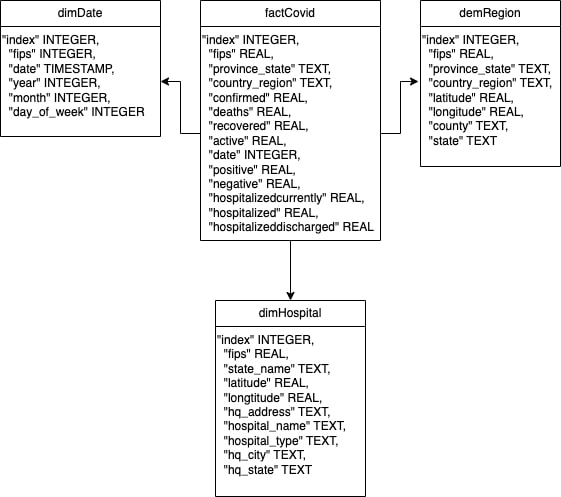

# Covid19
## Problem Description

Welcome to the COVID-19 Data Engineering Project! The main objective of this project is to apply data engineering concepts and utilize various tools on AWS to create an end-to-end data engineering solution for COVID-19 data analysis.

The project follows an Extract, Transform, Load (ETL) approach, where users can extract, load, and transform the data to gain valuable insights. The ultimate goal is to create a simple data engineering project that enables efficient handling and analysis of COVID-19 data.

## Key steps:
- Upload 'COVID-19 Data Lake' from a Registry of Open Data on AWS to Amazon S3: The project begins by uploading the 'COVID-19 Data Lake' from a Registry of Open Data onto the Amazon S3 storage service. 
- Create and Run Crawlers in Amazon Athena: Next, we set up and execute crawlers within Amazon Athena. These crawlers scan the tables stored in the Amazon S3 buckets, extracting structured data and making it easily accessible for analysis.
- Python ETL Job: We implement an ETL job in Python, which focuses on converting the relational data model into a dimensional data model using a STAR schema. 
- Upload Transformed Data to Amazon S3: After the ETL job is executed, the resulting DataFrame is converted into a CSV-formatted string representation. This transformed data is then uploaded back to an Amazon S3 bucket for storage and convenient access.
- Create, Configure VPC Networking, Connect, and Run ETL Job in AWS Glue: In this step, we create and configure Virtual Private Cloud (VPC) networking. By establishing secure communication and connectivity, we can seamlessly run the ETL job in AWS Glue to create tables in Amazon Redshift. 

## Tech Stacks

To build an end-to-end data pipeline for this project, we'll be utilizing the following tools:

- **Python**: including data extraction, transformation, and loading.
- **SQL**: querying and manipulating data within databases.
- **Amazon Athena**: Athena is instrumental in running queries on our data stored in Amazon S3. It allows us to analyze structured and semi-structured data using standard SQL syntax.
- **AWS Glue**: Glue is an ETL (Extract, Transform, Load) service provided by AWS. We'll utilize it to create and run our ETL jobs, transforming data between various formats and storing it in the desired destination.
- **Amazon Redshift**: Redshift is a fully-managed data warehousing service offered by AWS. It will serve as our storage and querying solution for large-scale data analysis.
- **Amazon S3**: S3 (Simple Storage Service) is an object storage service that will be used to store our raw and transformed data. It provides high durability, availability, and scalability.
- **IAM (Identity and Access Management)**: IAM will be employed to manage user access and permissions to various AWS resources, ensuring secure and controlled data handling.

## Data Model
Before:

After:
